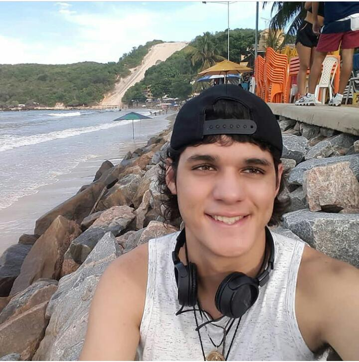
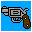
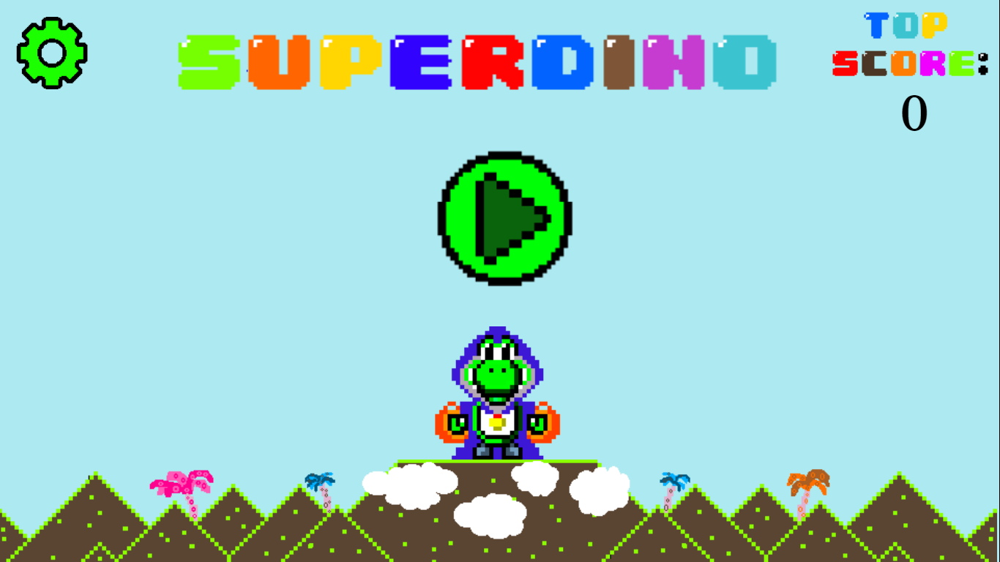

# Meu portifólio:
 
## William Campos, 20 anos.

# Sobre mim:
## Faço programação de jogos digitais no IFRN campus ceará-mirim, e meu grande sonho é me tornar um execelente programador de jogos digitais, amo estar na praia e em lugares semelhantes, passo meu tempo livre assistindo um monte de séries e vendo gameplays de jogos que me inspiro para programar, além de que as vezes dou uma de artista em pixelart, você pode acompanhar um pouco mais do meu trabalho a seguir, dá uma olhada!

# Artes feitas:
## Temos aqui um pistoleiro que fiz em umas de minhas primeiras artes no estilo pixel art:

## Esta é a arma que ele usaria pra matar alguns monstros:

## Este é um gif que fiz no piskel, utilizando uma dica de um amigo meu, devo adimitir que ficou bem legal e curti muito ela:

# Alguns de meus jogos: 

## Super Dino:

<a href = "https://lemuelmarques.github.io/SUPERDINO/" target = "_blank"> CURTA MEU GAME!  </a>
 <!-- 1. Adicionar um Link (url):
  [Clique aqui](https://pbs.twimg.com/profile_images/505770595422699521/n8bFETLR.jpeg)-->
  
 <!-- 2.Adicionar uma imagem da internet:
  -->
  
  <!--3. Adicionar uma imagem do computador (arquivo):
  -->
 
  <!--4.Adicionar um link que seja a imagem : 
  -->
  
  <!--5.Adicionar um link que seja a imagem e que abra em uma nova guia:
   -->
# Contatos

## 1. E-mail: Camposwilliam23@gmail.com
## 2. Facebook: 
<a href = "https://m.facebook.com/william.campos.7712?ref=bookmarks" target = "_blank">  CLIQUE AQUI PARA VER MEU PERFIL NO FACEBOOK!</a> 

